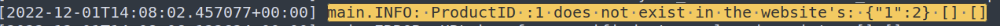
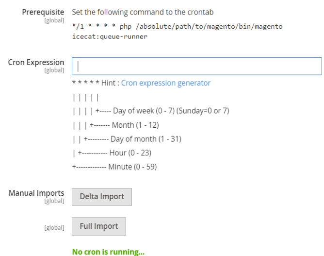
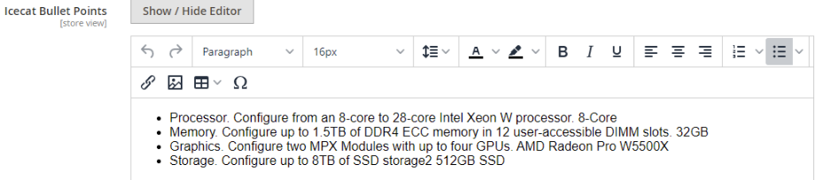
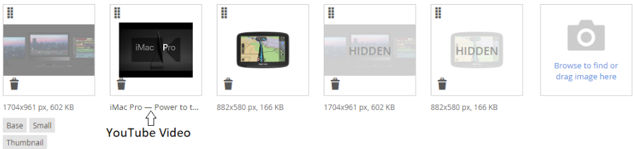
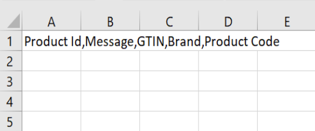

# Icecat Extension

The open-source Icecat extension gives the capability to enrich Magento 2 product catalog from the open and free Icecat rich product catalog.

**New features in version 2.0.0**
- Unlock the Full Icecat users
- Filter and Bulk Import Products by Specific Brands

[Click here to see full details for version 2.0.0](./doc/v2.md)

**Icecat Magento-Extension Version 1.0.0**

Installation Prerequisites: Magento Open Source 2.4.5

**Installation**

To install this extension, use the following commands:
~~~~~~~~~~~~~~~~~~~~~
composer require icecat/magento2-extension
php bin/magento module:enable Icecat_DataFeed
php bin/magento setup:upgrade
php bin/magento setup:static-content:deploy
php bin/magento setup:di:compile
php bin/magento indexer:reindex
php bin/magento cache:flush
~~~~~~~~~~~~~~~~~~~~~

**Note(s):**

- After installation, verify if the **dragonmantank/cron-expression** library has been installed. You may check this by going into **/<yourproject>/vendor/dragonmantank**. If this exists then it is fine.If not, then a manual installation is recommended using the following command **composer require dragonmantank/cron-expression**

- Set the following command to the crontab - prerequisite for the scheduled job
 ```bash
* * * * * php /**<yourproject>**/bin/magento icecat:queue-runner 2>&1 | grep -v "Icecat Cron" >> /**<yourproject>**/var/log/icecat.cron.log
```

- To be able to play/embed YouTube videos, the YouTube API configuration is required in the Magento 2 as mentioned in the following link- https://docs.magento.com/user-guide/v2.3/catalog/product-video.html 

- The system.log file is logged with the details when the product is not assigned to any of the store(s). Sample log

    

- The Icecat Extension will be added in the default Magento store configuration section.

    

**Features**
- An Open-Source plug-and-play extension and MIT licensed under Icecat NV.
- A user-friendly interface to configure the Icecat import attributes.
- Multi-store and multi-website catalog management to drive more business.
- Import all the product data from Open-Icecat catalog including Icecat categories, marketing text, specifications, images, YouTube videos, pdf, product stories, reasons to buy, bullet points and product reviews.
- Recurring bulk imports, Automatic -full- or Manual -Delta & Full- or single product imports.
- Complete downloadable import job summary statistics for immediate action.

**MIT license And Contact Details**


**Configuration Details**
- General Configuration - Enable the Icecat Extension.

    

- User Authentication - An Open-Icecat user account and API access token is required to import the product data via Icecat API. New users could easily get these details by using the “Register with Icecat” option as mentioned below. 

    

- The API access token could be easily generated by logging-in on icecat.biz.

    

- Store Configuration - The extension will import the product data only in the selected stores locales.

    

- Icecat Configuration - One time attribute mapping is required to import the data via Icecat API. These attributes are created by the end user in the Magento environment and the icecat extension will use these attributes to match the product in the Icecat catalog.

    Notes:
    - The attributes scope must be global and of type text.
    - The attributes must be part of the attribute set used for the magento product catalog.
    

- Icecat Categorization - Once enabled, a one time new root category named “Icecat Categories” will be created without any impact on the Default Category. The Icecat Categories then could be utilized as per need, for example - by assigning to the required store into General Configurations or by moving specific categories to the Default Category.

    

- Icecat Media - Images and YouTube videos -only public- are imported into the Magento’s default “Images And Videos'' section. If more than one store is configured, the user will see all the images and videos in the Default Store View.  However, once a particular store view is enabled, images and videos will be active for that store view and all the images and videos from other stores views will be marked as hidden. 

    All the documents are stored in the table icecat_product_attachtment.

    

- Icecat Specifications - All the specifications are imported into the icecat_specifications attribute with default Icecat heading color. The user has flexibility to change the color in order to match their Web shop’s theme.

    

- Icecat Other Enriched Fields - Icecat Product Reviews are stored in the table icecat_product_reviews. All the remaining fields are Magento attributes and have been created by default during the Icecat extension installation.

    

- Icecat Basic Fields - By default all the basic Icecat attributes will be created and mapped in order to save the time. Only the standard Magento attributes are required to be mapped by the Magento user. The user has flexibility to keep only the required fields as per need.

    

- Recurring bulk imports - Users will be able to automate full import with the cron expression.
    
    Full Import takes all the products from the Magento product catalog and for the matched products in the Icecat catalog, imports back the specified product data into the Magento catalog as per the configurations.
    
    Delta Import takes all the products which have been updated in the Magento product catalog since the last full/automatic import run.

    

- Single Product Import - On the product details page, the user has flexibility to import single product data on    demand.

    

**Icecat Categories**

- Icecat Categories - On very first import, automatically a new root category named “Icecat Categories” will be created.

    

**Product Data Details**
- On the product details page, all the Icecat product data will be available under the highlighted sections.
    

- Content
    

    

- Icecat Product Reviews

    

- Icecat Product Attachments

    

- Icecat Product Content

    

    

    

    

- Bullet Points

    

- Images And Videos

    

YouTube Video View
    


**Related Products**
While importing the product from Icecat Catalog, all the related products will be searched in the Magento Catalog using Brand Name and Product Code. All the matched products will be then linked under the main product.


**Import Statistics**


Not found in Icecat: These are the products present in the Magento Catalog but not in the Icecat Catalog. If you would like to publish these products into Icecat, contact us.
 
Forbidden in Icecat: A full icecat subscription is required to access these products.


