# icecat-magento

## Icecat plugin v1.0.0

This extension adds a comprehensive import functionality to Magento. It allows importing data from open-Icecat and uses the data to create Magento products.

**Installation**
Prerequisites : 
	Magento v2.4.x

To install this plugin use following commands:
- Download via command : git clone https://github.com/IcecatNV/magento.git
- Enable the plugin : bin/magento module:enable Icecat_DataFeed
- DI compilation - bin/magento setup:di:compile
- Static content deploy - bin/magento setup:static-content:deploy
- Cache cleaning - bin/magento cache:clean
- Install the cron package : composer require dragonmantank/cron-expression": "^v3.3.2"

**Features in a nutshell**
- Helpful Icecat links on the login screen.
- Configure Import from open-icecat.
- Create Products in magento using imported data.
- Provide Products preview.
- Single product import.
- Recurring bulk import - on demand and scheduled.
- Addition of more enriched content
- PSR1 and PSR2 complete code compliant

**Steps to use :**
1. After successful installation, you can see the icecat menu in your store configuration.
2. You can open the icecat integration panel by clicking on it.
3. You will get some tab there like below attachment.
    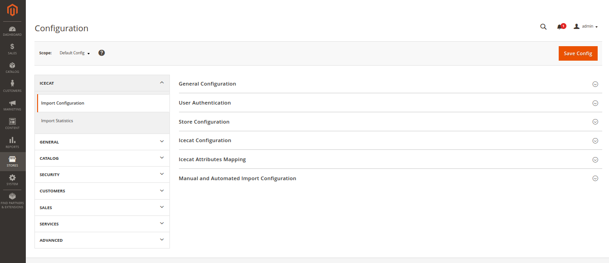
4. First you need to enable it from General Configuration tab. You will need to authenticate yourself by providing open-icecat account credentials.
    
5. After that next tab is related to store configuration in this you have to select atleast one store.   
    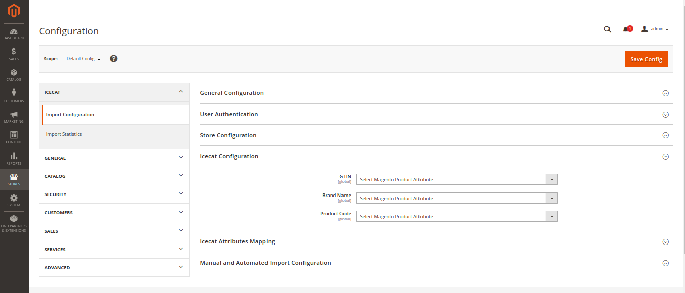
6. In this configuration menu you have to choose in which field you want to fill GTIN, Product Code and Brand Code.
    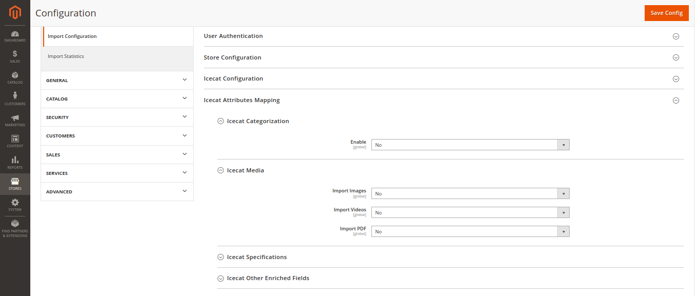
7. After that you have Icecat Attribute Mapping tab. In this there are some menus.
    - **Icecat Categorization** In this you can choose that you want to import product category or not.
    - **Icecat Media** In this you can choose that you want to import media, pdf or not.
    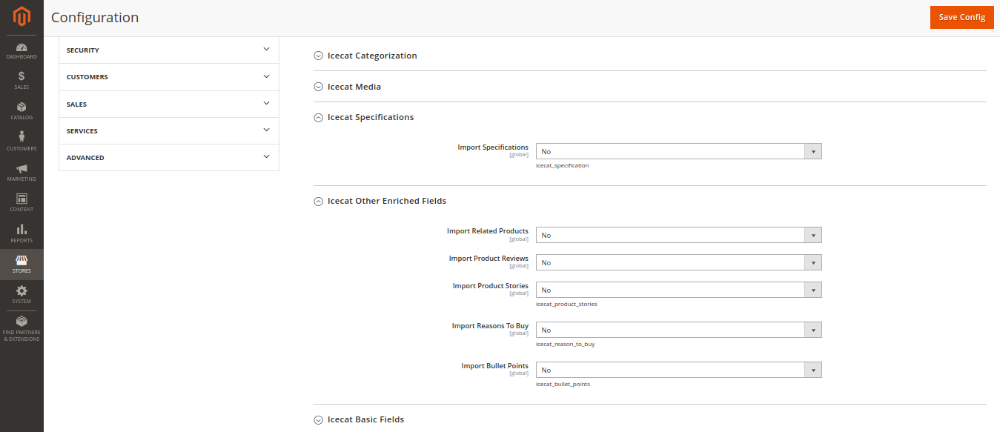
    - **Icecat Specification** In this you can choose that you want to import specification or not.
    - **Icecat Other Fields** In this you can choose that you want to import related products, product reviews, product stories, reasons to buy, bullet points.
    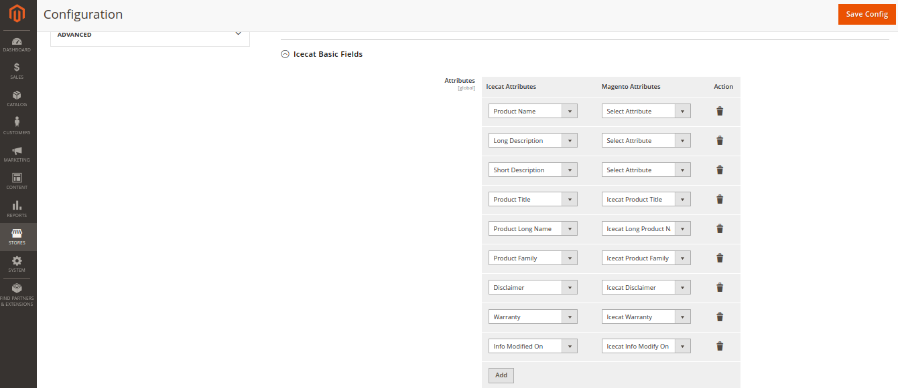
    - In the bottom of Icecat Attribute Mapping tab there is option in which you can choose which icecat attribute you want to map with magento attribute.
    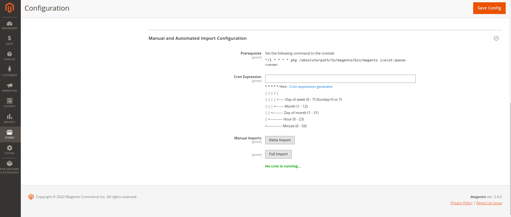
8. If you want to schedule your import process.Then there is the tab Icecat Queue Processor.
    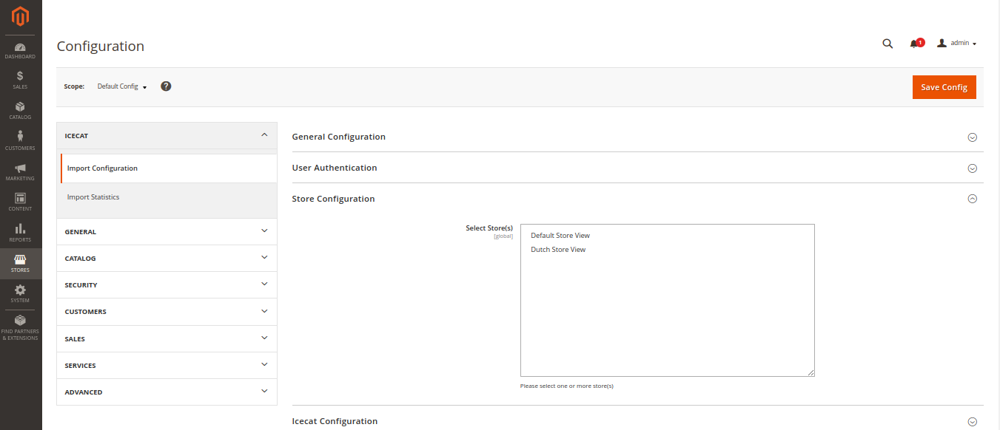

**Product’s content on admin panel:**

- **Video** : User can see the video in edit section and also in product’s preview section.
    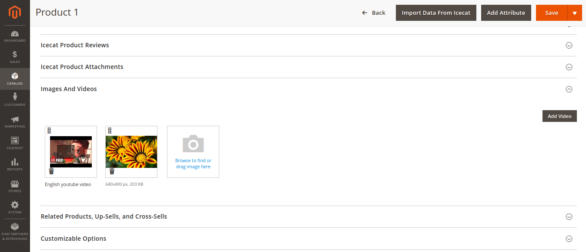
- **Document** : User can see the attachment in edit section.
    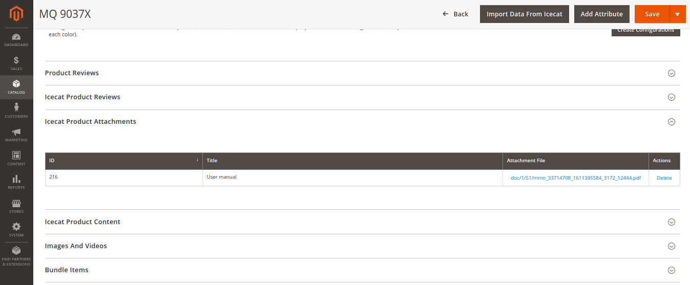    
- **Specifications** : It contains the dynamic specification of the product , which can vary product wise.
    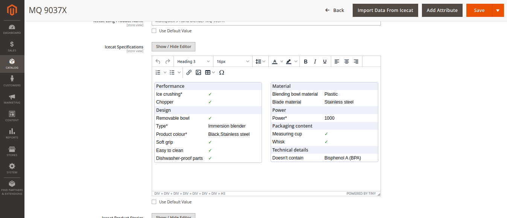    
- **Story**: Product story can be seen also, in a rich html format.
    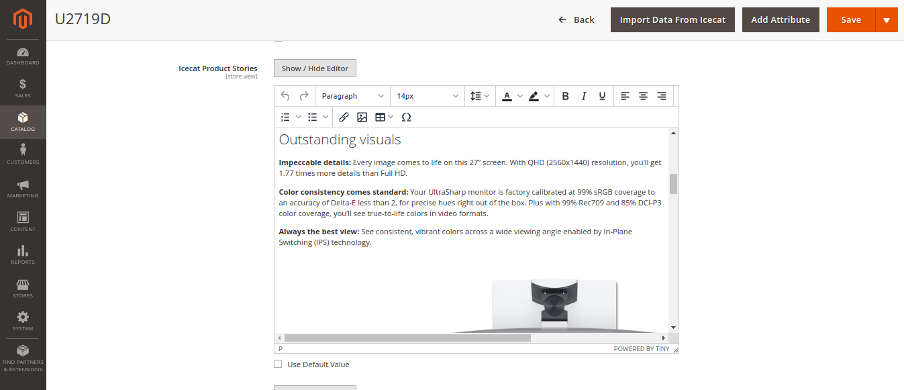
- **Reasons to buy**: Product reasons to buy can be seen also, in a rich html format.
    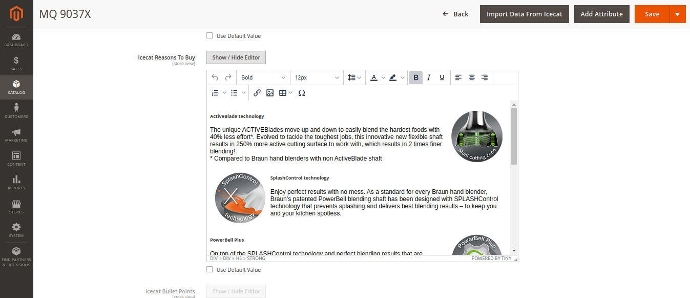

**Product’s content on frontend:**

- **Document** : User can see the attachment on frontend also.
    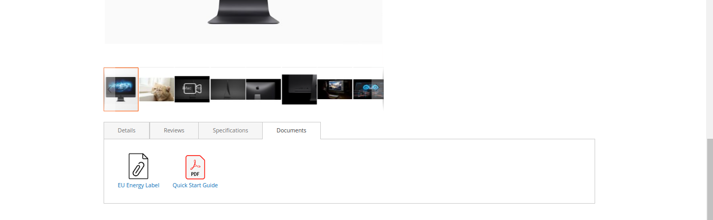    
- **Specifications** : It contains the dynamic specification of the product , which can vary product wise.
    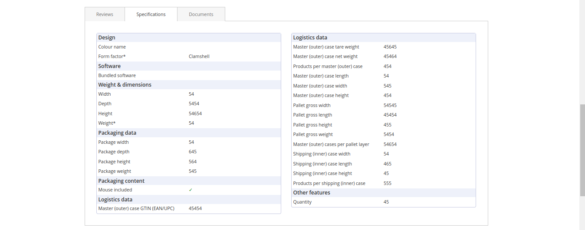    
- **Reasons to buy**: Product reasons to buy can be seen also on frontend.
    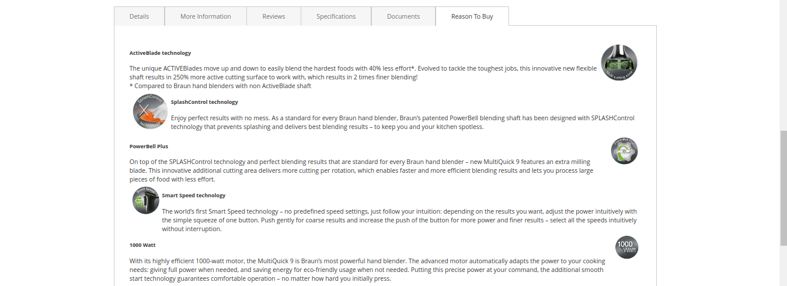