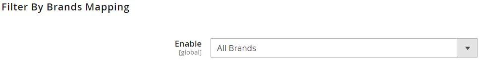
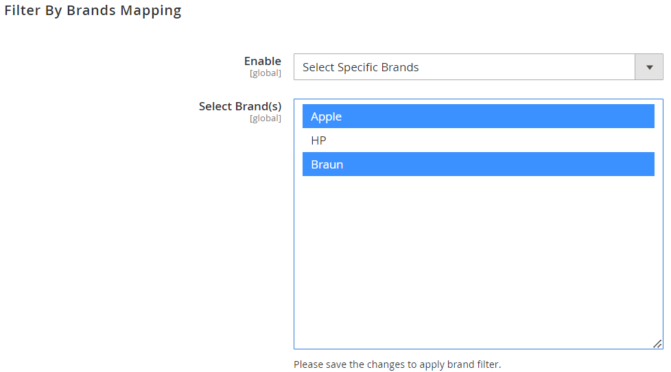

# Icecat Magento-Extension Version 2.0.0

The version 2.0.0 extension is compatible with Magento ver. 2.4.5-p1

**Install the latest magento-extension version 2.0.0**

~~~~~~~~~~~~~~~~~~~~~
composer require icecat/magento2-extension
php bin/magento module:enable Icecat_DataFeed
php bin/magento setup:upgrade
php bin/magento setup:static-content:deploy
php bin/magento setup:di:compile
php bin/magento indexer:reindex
php bin/magento cache:flush
~~~~~~~~~~~~~~~~~~~~~

**Update the existing magento-extension version 1.0.0 to version 2.0.0**

~~~~~~~~~~~~~~~~~~~~~
composer require icecat/magento2-extension:2.0.0
php bin/magento setup:upgrade
php bin/magento setup:static-content:deploy
php bin/magento setup:di:compile
php bin/magento indexer:reindex
php bin/magento cache:flush
~~~~~~~~~~~~~~~~~~~~~

**New features listing**

**Unlock the Full Icecat users**

Login as an Open or Full Icecat user, input the following details and Save Config:
- User Name
- Password
- API Access Token

    

Open Icecat users will have access to the exclusive "Upgrade to Full Icecat" link. 

Full Icecat User will have to input following additional details:

- Content Access Token 
- App Key

    

- To access your API Access Token, Content Access Token, and App Key details, simply log into https://icecat.biz and navigate to "My Profile." 

    

**Filter and Bulk Import Products by Specific Brands**

Default Filter: All Brands

- By selecting this option, all products from your Magento catalog will be considered for importing product data from Icecat.

    

Select Specific Brands

- When choosing this option, unique brand names will be populated based on the Brand Name attribute that has already been mapped in the "Icecat Configuration" section. You can then import product data specifically for these selected brands.

    

In this case, only products from the Magento catalog belonging to the Apple and Braun brands will be considered for importing product data from Icecat. Which means, products from other brands, such as HP, will not be imported.

Important Note: After making any configuration changes, flushing the Magento Cache is strongly recommended. 
